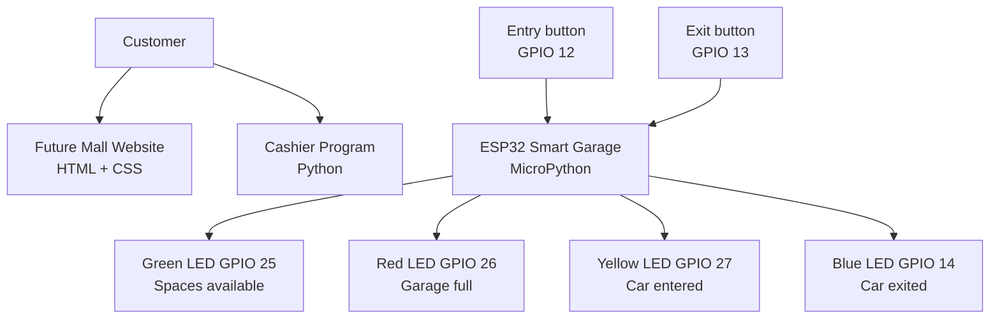

# Future Mall System Diagram

**Project ID:** EYOUTH-30909090117044

The website introduces the mall, the cashier program calculates a shopping total, and the ESP32 program controls the garage indicator lights.
